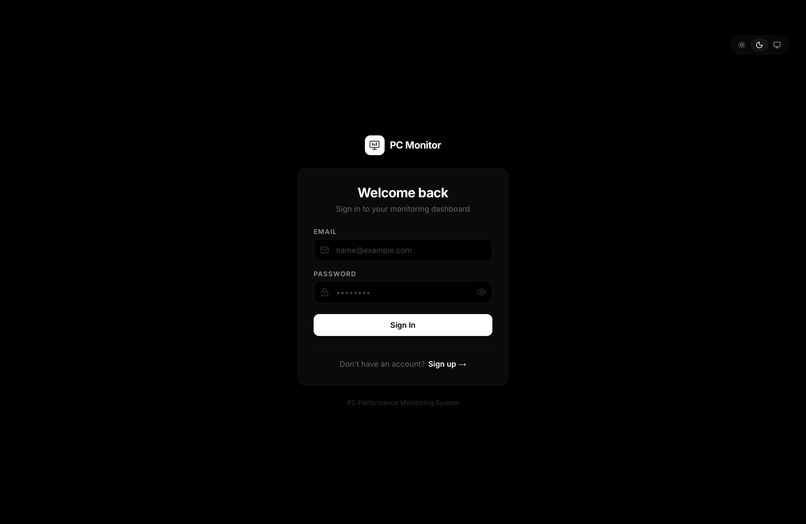
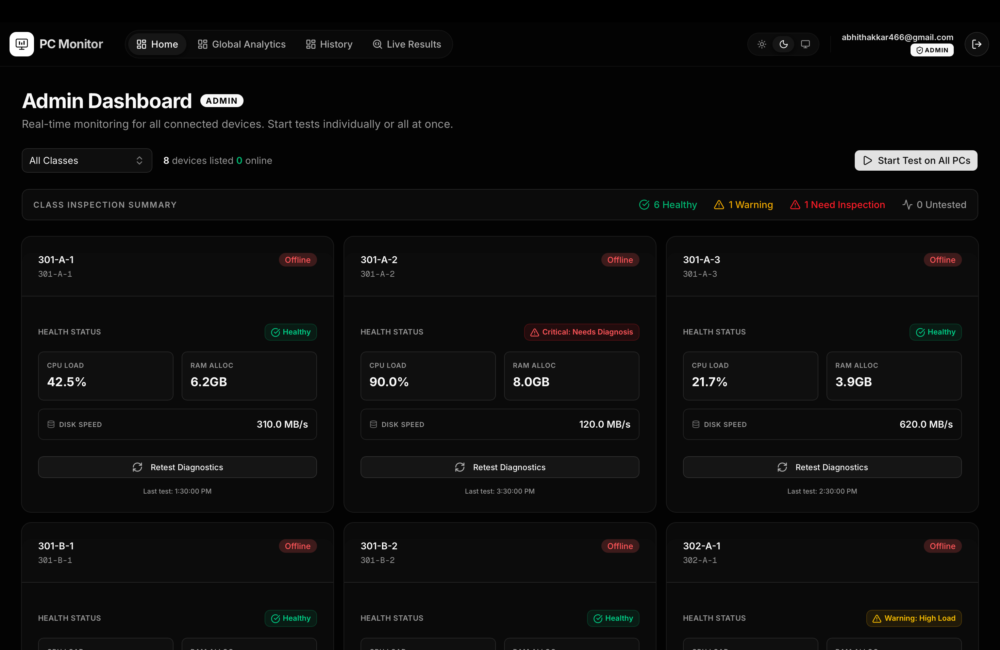
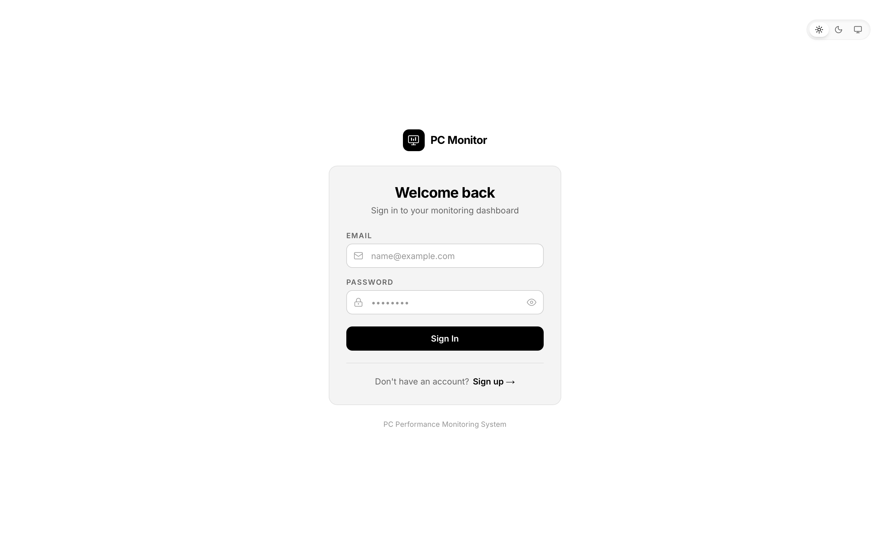
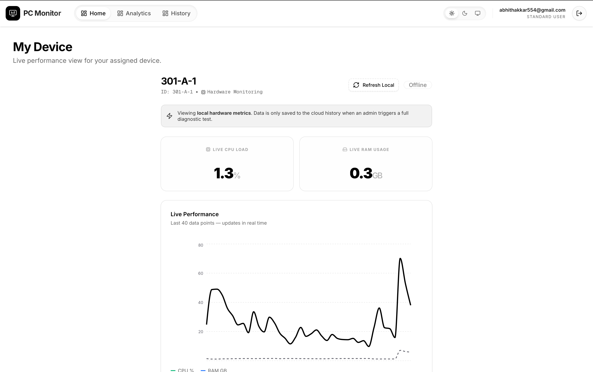

# PC Performance Monitoring System

A centralized hardware performance monitoring platform and diagnostic dashboard. This system provides real-time hardware telemetry and historical analytics without the footprint of a traditional background daemon.

## Full Documentation

Our documentation is structured according to the Diátaxis framework to help you quickly find what you need.

Please refer to our **[`doc/` directory](doc/README.md)** for comprehensive guides:

- **[Tutorials](doc/tutorials/getting-started.md)**: Step-by-step guides for new users to get their first device registered and monitored.
- **[How-to Guides](doc/how-to/run-locally.md)**: Practical guides for specific tasks, such as setting up the environment and configuring Supabase.
- **[Reference](doc/reference/database-schema.md)**: Technical reference material detailing the Supabase database schema, RLS policies, and components.
- **[Explanation](doc/explanation/architecture.md)**: Deep dives into the system architecture and the [Problem Statement & Tech Stack](doc/explanation/problem-statement.md).

## Quick Links

- **Stack**: Next.js 16.2 (App Router), React 19, Supabase (Realtime, Postgres), Node.js, Tailwind v4.
- **Key Feature**: [Client-Driven Passive Monitoring](doc/explanation/architecture.md) (zero idle resource drain).

## Screenshots

### Dark Mode

### Light Mode

## Licenses

MIT License
