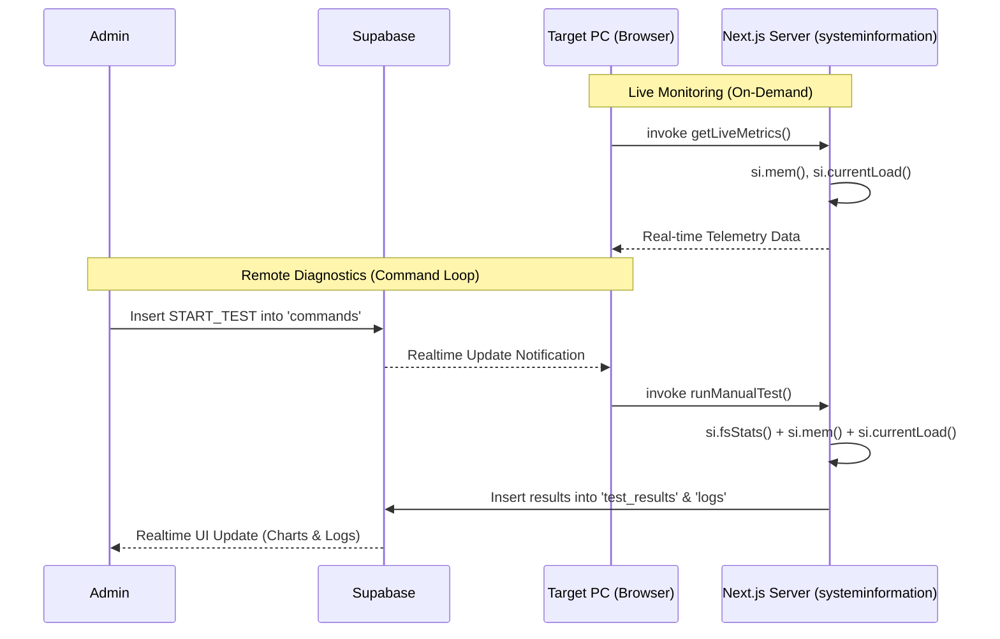

# PC Performance Monitoring System

A centralized hardware performance monitoring platform and diagnostic dashboard. This system provides real-time hardware telemetry and historical analytics through a high-contrast, demand-driven architecture.

## Primary Features

### 🚀 Demand-Driven Monitoring
The application utilizes a local-first monitoring model that eliminates persistent background network traffic. Hardware metrics are retrieved on-demand by the client interface, significantly reducing server overhead and local resource consumption.

### 📊 Local Telemetry Dashboard
Real-time metrics for CPU and RAM are fetched directly from the host system via `systeminformation`. This data is displayed locally to provide immediate feedback without unnecessary database persistence.

### 🛡️ Administrative Diagnostics
Administrators possess the authorization to trigger full system diagnostic tests across the registered device fleet. These tests include disk I/O performance measurements and are persisted to the database for long-term reporting.

### 📈 Historical Performance Analytics
The platform provides comprehensive visualization of performance trends using Recharts. Charts are theme-aware, utilizing dynamic color resolution to maintain legibility across both light and dark system color schemes.

### 📜 Activity Logging and Auditing
A dedicated history component provides searchable and filterable access to all previous diagnostic results and continuous telemetry logs, organized by device and time range.

## System Architecture & Workflow

The system utilizes a **Client-Driven Passive Agent** model. Instead of a persistent background daemon, monitoring logic is integrated directly into the web interface, executed by the host machine's browser session.

### Core Data Flow



### 1. Live Telemetry (Ephemeral)
When a user views their own device, the browser establishes a polling loop (via Server Actions) to fetch immediate hardware state. This data is displayed locally and is **not persisted** to the database, minimizing storage costs and network overhead.

### 2. Administrative Control Loop (Persistent)
Administrators can trigger remote diagnostics. This follows an asynchronous command pattern:
- **Command Issuance**: Admin inserts a record into the `commands` table.
- **Realtime Dispatch**: Supabase broadcasts the event to the target device's active session.
- **Local Execution**: The target device executes a privileged Server Action (`runManualTest`).
- **Result Persistence**: The hardware results are saved back to Supabase for historical auditing and group analytics.

## Technical Specification

- **Core Framework**: Next.js 16 (App Router)
- **Data Architecture**: Supabase (PostgreSQL, Realtime, RLS)
- **Hardware Telemetry**: `systeminformation` (Node.js)
- **Visualization**: Recharts (Dynamic SVG Rendering)
- **Styling**: Tailwind CSS 4.0 with Shadcn UI components
- **CI/CD**: GitHub Actions (Linting & Automated Builds)

## Deployment and Installation

### Prerequisites
- Node.js 20+ runtime environment
- Active Supabase project instance with Realtime enabled for `pcs`, `logs`, `commands`, and `test_results` tables.

### Configuration
A `.env` file must be provisioned in the root directory:
```env
NEXT_PUBLIC_SUPABASE_URL=your_supabase_url
NEXT_PUBLIC_SUPABASE_PUBLISHABLE_KEY=your_supabase_key
NEXT_RUNTIME=nodejs
```

### Initialization
```bash
npm install
npm run dev
```

## Continuous Integration
The project includes a GitHub Actions workflow (`ci.yml`) that automatically:
1. Checks out the source code.
2. Sets up the Node.js environment.
3. Installs dependencies and caches them.
4. Performs linting across the codebase.
5. Validates the production build.

## License
MIT License

