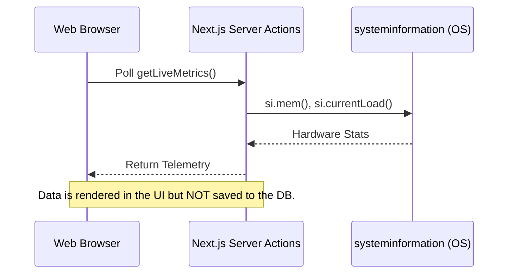
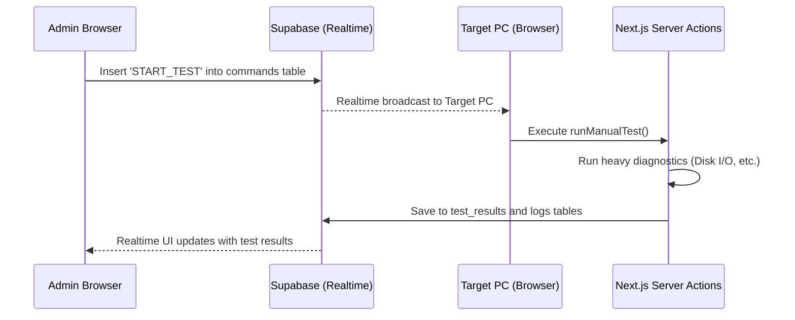

# Architecture and Design

## Context and Goals

The primary goal of the PC Performance Monitoring System is to provide fleet-wide hardware diagnostics without the burden of traditional background services. 

### Goals
1. **Zero Background Footprint**: Devices should not waste CPU/RAM monitoring themselves unless actively requested.
2. **Real-time Responsiveness**: Administrators must be able to trigger tests and see results immediately.
3. **High Security**: Avoid requiring root-level daemons; use standard web browser sandboxes where possible, augmented by Node.js server actions.

---

## High-Level Design: The Client-Driven Passive Agent Model

The system utilizes Next.js Server Actions and Supabase Realtime to turn the user's active browser session into a temporary monitoring agent.

### 1. Live Ephemeral Telemetry (Dashboard View)

When a user opens the web application, their browser initiates a polling loop.

*   **Trade-off**: This requires the web app to be open to view live stats. 
*   **Benefit**: Zero database write costs and zero background CPU usage when the app is closed.

### 2. Remote Diagnostic Control Loop (Persistent)

When an administrator needs to run a test on a remote machine in the fleet, the system relies on Supabase Realtime to bridge the gap.

### Key Decisions

1. **Supabase Realtime over WebSockets**: We chose Supabase Realtime because it integrates natively with PostgreSQL. Inserting a command into the database automatically triggers a payload to subscribed clients without managing a separate WebSocket server.
2. **Next.js Server Actions**: By using App Router Server Actions, we can execute Node.js specific libraries (like `systeminformation`) securely on the server side, while seamlessly triggering them from client-side React components.
3. **Recharts over Chart.js**: We selected Recharts for data visualization because its declarative, React-first SVG rendering integrates perfectly with Next-themes, allowing dynamic color switching between Dark/Light modes.
